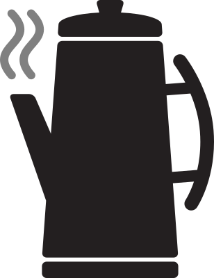

<p align="center">
  
</p>

# Percolate.js
Build websites/webapps using standard web apis and custom tags all while enjoying simple JS hydration.

## Why Percolate.js?
I built Percolate for the sole purpose of being able to build rich, interactive websites that load fast and don't rely on large build-tools, setting up environments, or complex JS-only frameworks. The entire idea of Percolate is to allow for one to build simple static sites that have a small layer of dynamic interactivity to them all using simple HTML, CSS, and JS.

## How does Percolate.js work?
Percolate.js uses a few web apis to allow for basic HTML pages to be transformed via hydrating custom, semantic tags. Currently the libary uses:
- `dynamic imports`
- `Intersection Observer`
- `document.evaluate`
- `requestIdleCallback`

This allows you to build views in static HTML which will then automatically be hydrated via Percolate and your own custom JS files.

## Getting Started
1. First things first, you'll need a basic website structure and an HTTP server to work from. Run the following commands to set that up:
```bash
mkdir my-website
cd my-website
touch index.html
```
For the HTTP server, feel free to use anything you'd like. Personally I use the node package `http-server` installed globally via npm. Once `http-server` is installed globally simply run the `http-server` command from the root of your website.
```bash
npm install -g http-server
http-server
```

2. Next you will want to download the Percolate library to the root of your web project, you can download the [unminified version]() or the [minified version]() depending on your needs. Once the libary is in your file structure, just import Percolate via a module script tag and initialize Percolate with whatever options you need:

```html
<script type="module">
  import Percolate from './path/to/percolate.js';
  
  Percolate({
    baseURL: '/',
    tagPartial: 'tagprefix-',
    successCallback: importPath => { console.log(`imported ${importPath}`) },
    errorCallback: importPath => { console.error(`Error importing ${importPath}`) }
  });
</script>
```
Here is the API for the options object:
- `baseURL` (Optional): The base url path for where your JS files are saved, defaults to `/`.
- `tagPartial`: The prefix of all your custom tags, e.g. if your tags look like this `<test-header></test-header>` then the `tagPartial` would be `test-`.
- `successCallback` (Optional): Function that runs each time a JS module is successfully imported.
- `errorCallback` (Optional): Function that runs as part of the import `catch` statement.

3. Now you're ready to build your site! The basic flow is to build out your semantic HTML using custom tags, e.g.:
```html
<!DOCTYPE html>
<html lang="en">
<head>
  <meta charset="UTF-8">
  <meta http-equiv="X-UA-Compatible" content="IE=edge">
  <meta name="viewport" content="width=device-width, initial-scale=1.0">
  <title>Percolate Site</title>
  <link rel="stylesheet" href="styles.css" />
</head>
<body>
  <test-navbar>
    <a href="/">Home</a>
    <a href="/about">About</a>
  </test-navbar>
  <test-clicker>
    <div id="count"></div>
    <button id="inc">Inc</button>
    <button id="dec">Dec</button>
  </test-clicker>
  <script type="module">
    import Percolate from './percolate.js';

    Percolate({
      baseURL: '/',
      tagPartial: 'test-',
      successCallback: importPath => { console.log(`imported ${importPath}`) },
      errorCallback: importPath => { console.error(`Error importing ${importPath}`) }
    });
  </script>
</body>
</html>
```
Then you build the corresponding JS files for each of your tags:

`test-navbar.js`
```javascript
// Whatever JS you want to interact with your component
document.querySelector('test-navbar').addEventListener('click', e => {
  if(e.target.tagName.toLowerCase() === 'a') {
    e.preventDefault();
    // Do some custom routing stuff
  }
});
```
`test-clicker.js`
```javascript
// Even web component code!
class TestClicker extends HTMLElement {
  constructor() {
    super();
    this.count = 0;
  }

  inc() {
    this.count++;
    this.querySelector('#count').innerText = this.count;
  }

  dec() {
    this.count--;
    this.querySelector('#count').innerText = this.count;
  }

  connectedCallback() {
    this.querySelector('#count').innerText = this.count;
    this.querySelector('#inc').addEventListener('click', this.inc);
    this.querySelector('#dec').addEventListener('click', this.dec);
  }
}

window.customElements.define('test-clicker', TestClicker);
```

4. You can also add a custom data attribute to your custom tags that allows Percolate to load the corresponding JS file only if the component is in view via an `IntersectionObserver`:
```html
<test-component data-loadonview="true"></test-component>
```

## Conclusion
That's the gist of the Percolate library! You can build static-based websites that gracefully adapt JS and interactivity depending on your needs.

## Credit
SVG and PNG Percolator Icon by: [StudioFibonacci](https://openclipart.org/artist/StudioFibonacci)
